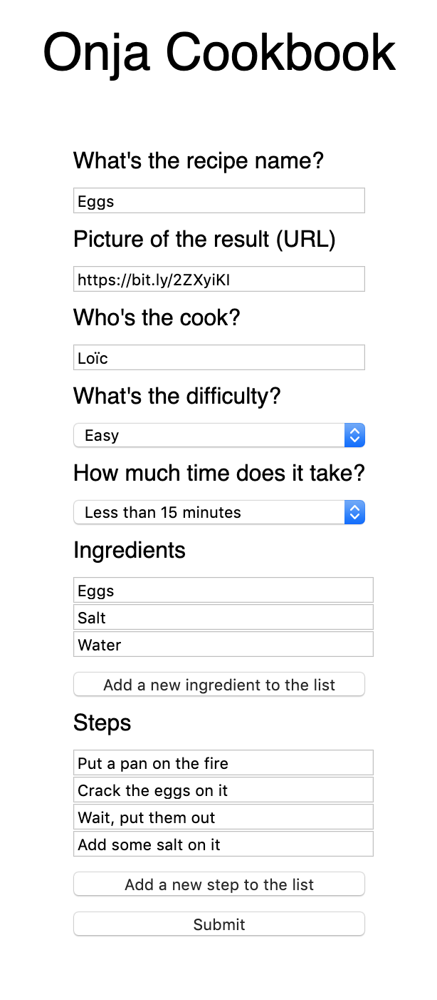

# Weekend Project 4 : Onja Cookbook

Hey team! Here's the project of the week.

We're going to build a form, for a recipe website.

## Here's the form content :

1. The recipe name
2. A photo for the recipe (url)
3. The cook's name
4. A difficulty level (Easy, Medium, Hard)
5. The timing (<15min, 15min, 30min, 45min, 60min, >1h)
6. The ingredients list
7. The steps to make it

The last two will be at first a single text input, and a button "Add a new ingredient" (or add a new step for the last one).

Each time you'll want to add a new step/ingredient to the list, you'll click this button, and a new input will appear.

It means that your recipe can have from **one to as many** ingredients as we want. The same concept applies to the steps.

The form will look like this :



After the form submission, I want the result to be stored inside an array of objects, called **_recipes._**

The last step is to show it into the console. It'll look like that :

```jsx
const recipes = [
	{
		title: 'Eggs',
		picture: 'https://bit.ly/2ZXyiKI',
		author: 'Loïc',
		difficulty: 'easy',
		timing: '15',
		ingredients: ['eggs', 'salt', 'water'],
		steps: [
			'Put a pan on the fire',
			'Crack the eggs on it',
			'Wait, put them out',
			'Add some salt on it',
		],
	},
];
```

This time, you'll have to start the project from scratch! 🤓

Feel free to make it shine with some great CSS.

Good luck, and happy coding ✨
